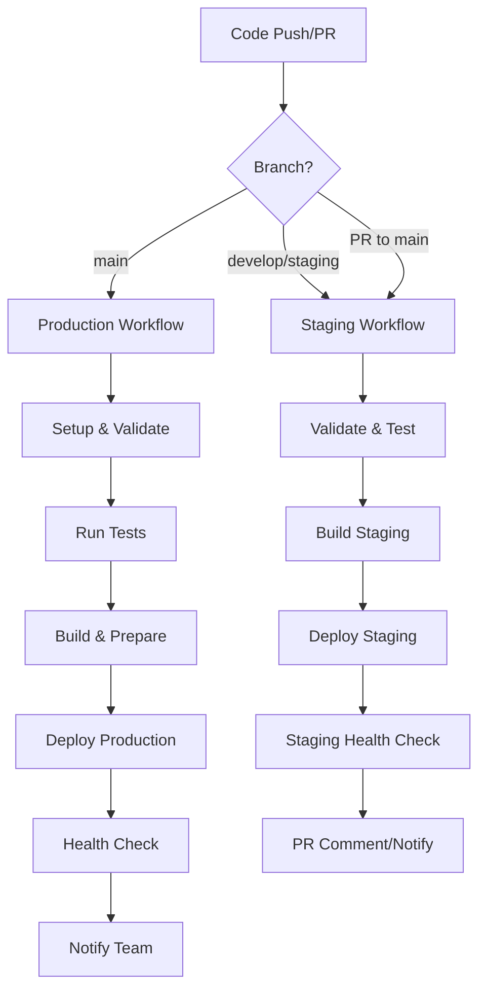

# 🚀 GitHub Actions CI/CD Workflows

This directory contains the automated deployment workflows for the WebQx Healthcare Platform. The workflows are designed to handle different environments and deployment scenarios while maintaining healthcare compliance and security standards.

## 📁 Workflow Files

### 🏭 Production Deployment (`deploy.yml`)
**Triggers:**
- Push to `main` branch (automatic)
- Manual trigger via `workflow_dispatch`

**Features:**
- Complete environment setup and validation
- Comprehensive test suite execution
- Multi-provider deployment support
- Health checks and monitoring
- Slack/email notifications
- Environment-specific configurations

### 🧪 Staging Deployment (`staging.yml`)
**Triggers:**
- Push to `develop` or `staging` branches
- Pull requests to `main` branch
- Manual trigger via `workflow_dispatch`

**Features:**
- Validation and testing for staging environment
- PR-based staging deployments
- Automated health checks
- PR comments with deployment status
- Staging-specific configurations

## 🔧 Workflow Architecture



## 🏥 Healthcare Compliance Features

### 🔒 Security
- Secure environment variable handling
- HIPAA-compliant encryption keys
- Secure credential management
- Audit logging for all deployments

### 📊 Monitoring
- Health check endpoints (`/health`, `/api/status`)
- Post-deployment validation
- Performance monitoring
- Error tracking and alerting

### 🔍 Validation
- TypeScript compilation checks
- Comprehensive test suites
- Code coverage reporting
- Security vulnerability scanning

## 🌍 Multi-Environment Support

| Environment | Branch | URL | Purpose |
|-------------|--------|-----|---------|
| **Production** | `main` | `https://webqx.org` | Live healthcare platform |
| **Staging** | `develop`, `staging` | `https://staging.webqx.org` | Testing and validation |

## 🚀 Deployment Providers

The workflows support multiple hosting providers:

### ☁️ Cloud Providers
- **AWS**: EC2, ECS, Elastic Beanstalk
- **Google Cloud**: App Engine, Cloud Run
- **Azure**: App Service, Container Instances

### 🌐 Platform-as-a-Service
- **Vercel**: Web application hosting
- **Netlify**: Static and serverless hosting
- **Railway**: Full-stack deployment
- **Heroku**: Application hosting

### 🖥️ Traditional Hosting
- **SSH Deployment**: Custom servers and VPS
- **Docker**: Containerized deployments
- **PM2**: Process management

## 📋 Setup Instructions

### 1. Required GitHub Secrets

See [DEPLOYMENT_SECRETS.md](./DEPLOYMENT_SECRETS.md) for the complete list of required secrets.

**Minimum Required:**
```
DATABASE_URL
JWT_SECRET
ENCRYPTION_KEY
SESSION_SECRET
FHIR_SERVER_URL
```

**Choose one deployment method:**
- SSH: `SSH_HOST`, `SSH_USER`, `SSH_PRIVATE_KEY`
- Vercel: `VERCEL_TOKEN`, `VERCEL_ORG_ID`, `VERCEL_PROJECT_ID`
- Railway: `RAILWAY_TOKEN`

### 2. Environment Configuration

Create GitHub Environments:
1. Go to **Settings** → **Environments**
2. Create `production` and `staging` environments
3. Configure environment-specific secrets
4. Set up protection rules (require reviews, restrict branches)

### 3. Notification Setup

**Slack Integration:**
1. Create a Slack webhook URL
2. Add `SLACK_WEBHOOK_URL` to repository secrets
3. Customize notification messages in workflow files

**Email Notifications:**
1. Configure SMTP settings in secrets
2. Add `NOTIFICATION_EMAIL` for recipients
3. Test email delivery

## 🔄 Workflow Customization

### Adding New Deployment Targets

To add support for additional hosting providers:

1. **Edit workflow files** (`.github/workflows/deploy.yml` or `staging.yml`)
2. **Add new deployment step:**
   ```yaml
   - name: 🚀 Deploy to NewProvider
     if: secrets.NEWPROVIDER_TOKEN
     run: |
       echo "Deploying to NewProvider..."
       # Add deployment commands
   ```
3. **Update documentation** with required secrets
4. **Test the deployment** in staging first

### Environment-Specific Workflows

Create additional workflow files for specific environments:

```yaml
# .github/workflows/development.yml
name: Development Deployment
on:
  push:
    branches: [ feature/* ]
# Add development-specific jobs
```

### Custom Health Checks

Extend health check functionality:

```javascript
// Add to server.js
app.get('/health/database', async (req, res) => {
  // Database connectivity check
  const isHealthy = await checkDatabaseConnection();
  res.status(isHealthy ? 200 : 503).json({
    status: isHealthy ? 'healthy' : 'unhealthy',
    component: 'database'
  });
});
```

## 🐛 Troubleshooting

### Common Issues

1. **Workflow fails on secrets**
   - Verify all required secrets are configured
   - Check secret names match exactly (case-sensitive)
   - Ensure secrets are available in the correct environment

2. **Deployment fails**
   - Check hosting provider credentials
   - Verify deployment target configuration
   - Review deployment logs in Actions tab

3. **Health checks fail**
   - Ensure application starts correctly
   - Verify health check endpoints are accessible
   - Check for startup delays or initialization issues

4. **Tests fail**
   - Review test logs in Actions tab
   - Consider using `skip_tests: true` for urgent deployments
   - Fix failing tests before merging to main

### Debug Mode

Enable detailed logging:
```yaml
env:
  ACTIONS_RUNNER_DEBUG: true
  ACTIONS_STEP_DEBUG: true
```

### Manual Workflow Triggers

Use workflow dispatch for manual deployments:
1. Go to **Actions** tab in GitHub
2. Select the workflow
3. Click **Run workflow**
4. Choose options and environment
5. Monitor execution

## 📊 Monitoring and Metrics

### Deployment Metrics
- Success/failure rates
- Deployment duration
- Health check response times
- Test coverage trends

### Application Metrics
- Server uptime and performance
- Memory and CPU usage
- API response times
- Error rates and logs

### Healthcare-Specific Monitoring
- FHIR endpoint availability
- Authentication service health
- Data encryption status
- Audit log integrity

## 🔗 Related Documentation

- [Main README](../README.md) - Project overview
- [Deployment Guide](../DEPLOYMENT.md) - Detailed deployment instructions
- [Environment Configuration](../.env.example) - Environment variables
- [Security Guidelines](../legal/) - HIPAA compliance information

## 🏥 Healthcare Platform Features

The workflows are specifically designed for healthcare platforms:

### 🔒 HIPAA Compliance
- Encrypted environment variables
- Secure credential handling
- Audit logging for all deployments
- Data protection measures

### 🏥 Medical System Integration
- FHIR R4 server deployments
- HL7 integration testing
- EHR system compatibility
- Healthcare API validations

### 📱 Multi-Platform Support
- Patient portal deployments
- Provider dashboard updates
- Admin console management
- Mobile app backend services

---

**🏥 WebQx Healthcare Platform** - Automated deployment for global clinical care.