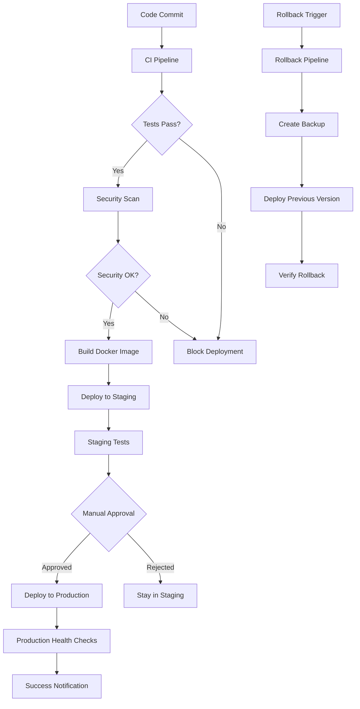

# 🚀 WebQX Healthcare Platform - CI/CD Pipeline Documentation

This document provides comprehensive documentation for the CI/CD pipelines deployed for the WebQX Healthcare Platform PACS system, ensuring seamless integration and delivery of updates with robust safety measures.

## 📋 Table of Contents

- [Overview](#overview)
- [Pipeline Architecture](#pipeline-architecture)
- [Workflows](#workflows)
- [Environment Configuration](#environment-configuration)
- [Deployment Process](#deployment-process)
- [Rollback Procedures](#rollback-procedures)
- [Monitoring and Notifications](#monitoring-and-notifications)
- [Security and Compliance](#security-and-compliance)
- [Troubleshooting](#troubleshooting)
- [Maintenance](#maintenance)

## 🏗️ Overview

The WebQX Healthcare Platform implements a robust CI/CD pipeline designed specifically for healthcare applications, with enhanced security, compliance checks, and safety measures required for medical software systems.

### Key Features

- ✅ **Automated Testing**: Unit, integration, and end-to-end tests
- 🔒 **Security Scanning**: Vulnerability detection and compliance checks
- 🏥 **Healthcare Compliance**: HIPAA and medical data safety validations
- 🚀 **Automated Deployments**: Staging and production deployment automation
- 🔄 **Rollback Capabilities**: Rapid recovery mechanisms
- 📊 **Comprehensive Monitoring**: Health checks and performance monitoring
- 📢 **Team Notifications**: Slack/email integration for deployment status

## 🏛️ Pipeline Architecture



### Environment Flow

1. **Development** → Push to `develop` branch
2. **Staging** → Automatic deployment after CI success
3. **Production** → Manual approval required + additional safety checks
4. **Rollback** → Manual trigger with approval gates

## 🔄 Workflows

### 1. Continuous Integration (`ci.yml`)

**Triggers**: Push to `main`/`develop`, Pull Requests

**Jobs**:
- **Lint & Type Check**: Code quality validation
- **Unit Tests**: Automated test execution with coverage
- **Integration Tests**: Database and API integration testing
- **Security Scan**: Vulnerability and dependency scanning
- **Docker Build**: Container build verification
- **Compliance Check**: Healthcare-specific security validations
- **E2E Tests**: End-to-end functionality testing (PR only)

**Duration**: ~15-20 minutes

### 2. Staging Deployment (`deploy-staging.yml`)

**Triggers**: 
- Push to `develop` branch
- Successful CI completion

**Jobs**:
- **Pre-deployment Checks**: Version validation and setup
- **Build for Staging**: Environment-specific build process
- **Deploy to Railway**: Automated staging deployment
- **Health Checks**: Comprehensive staging verification
- **Backup Creation**: Versioned backup for recovery
- **Team Notifications**: Success/failure alerts

**Duration**: ~10-15 minutes

### 3. Production Deployment (`deploy-production.yml`)

**Triggers**: Manual workflow dispatch only

**Jobs**:
- **Pre-production Validation**: CI status and version verification
- **Manual Approval**: Required approval gate with environment protection
- **Pre-deployment Backup**: Complete system state backup
- **Build for Production**: Production-optimized build
- **Deploy to Production**: Zero-downtime deployment
- **Health Verification**: Extended health and stability checks
- **Post-deployment Backup**: Success state backup
- **Team Notifications**: Comprehensive deployment status

**Duration**: ~25-35 minutes (including approval time)

### 4. Rollback (`rollback.yml`)

**Triggers**: Manual workflow dispatch only

**Jobs**:
- **Rollback Validation**: Target version and safety validation
- **Emergency Approval**: Production rollback approval (unless emergency)
- **Pre-rollback Backup**: Current state preservation
- **Execute Rollback**: Automated rollback deployment
- **Rollback Verification**: Health and version verification
- **Status Updates**: Issue tracking and team notifications

**Duration**: ~10-15 minutes

## ⚙️ Environment Configuration

### Required Secrets

Configure these secrets in your GitHub repository settings:

```bash
# Railway Configuration
RAILWAY_TOKEN                    # Railway CLI authentication token
RAILWAY_STAGING_PROJECT_ID       # Staging environment project ID
RAILWAY_PRODUCTION_PROJECT_ID    # Production environment project ID

# Notification Configuration
SLACK_WEBHOOK_URL               # Slack webhook for notifications (optional)

# Security Scanning
SNYK_TOKEN                      # Snyk security scanning token (optional)
```

### Environment Variables

#### Staging Environment
```bash
NODE_ENV=staging
DEPLOYMENT_ENV=staging
DATABASE_URL=postgresql://staging-db-url
API_BASE_URL=https://staging-api.webqx.health
```

#### Production Environment
```bash
NODE_ENV=production
DEPLOYMENT_ENV=production
DATABASE_URL=postgresql://production-db-url
API_BASE_URL=https://api.webqx.health
```

### GitHub Environment Protection

1. **Staging Environment**:
   - No approval required
   - Deploy from `develop` branch only

2. **Production Environment**:
   - Required reviewers: DevOps team, Lead Developer
   - Deployment branches: `main` only
   - Environment secrets for production configuration

3. **Production Rollback Environment**:
   - Required reviewers: Senior DevOps, Technical Lead
   - Emergency bypass available

## 🚀 Deployment Process

### Staging Deployment

1. **Automatic Trigger**: Push to `develop` branch
2. **CI Validation**: All tests must pass
3. **Deployment**: Automatic deployment to staging
4. **Verification**: Health checks and smoke tests
5. **Notification**: Team notification of deployment status

### Production Deployment

1. **Manual Trigger**: Use GitHub Actions UI
   - Go to Actions → Deploy to Production
   - Select version (commit SHA or tag)
   - Provide deployment reason
   - Enable team notifications

2. **Pre-deployment**:
   ```bash
   # Example manual trigger
   gh workflow run deploy-production.yml \
     -f version=main \
     -f reason="Monthly release with new features" \
     -f notify_teams=true
   ```

3. **Approval Process**:
   - Automated validation checks
   - Manual approval from designated reviewers
   - Security and compliance verification

4. **Deployment Execution**:
   - Pre-deployment backup creation
   - Production build generation
   - Zero-downtime deployment
   - Comprehensive health verification

5. **Post-deployment**:
   - Extended monitoring period
   - Post-deployment backup
   - Team notifications
   - Documentation updates

### Rollback Process

1. **Emergency Rollback**:
   ```bash
   # Immediate rollback (bypasses some checks)
   gh workflow run rollback.yml \
     -f environment=production \
     -f version=previous \
     -f reason="Critical security vulnerability" \
     -f emergency=true
   ```

2. **Standard Rollback**:
   ```bash
   # Standard rollback with full safety checks
   gh workflow run rollback.yml \
     -f environment=production \
     -f version=v1.2.3 \
     -f reason="Performance regression" \
     -f emergency=false
   ```

## 🔄 Rollback Procedures

### Automated Rollback Triggers

The system provides rapid rollback capabilities for various scenarios:

- **Failed Health Checks**: Automatic rollback if health checks fail
- **Performance Degradation**: Monitor response times and system stability
- **Security Incidents**: Emergency rollback procedures
- **Data Integrity Issues**: Rapid recovery mechanisms

### Rollback Types

1. **Previous Version Rollback**:
   - Automatically determines the last successful deployment
   - Restores to the most recent stable state

2. **Specific Version Rollback**:
   - Target a specific commit SHA or release tag
   - Useful for reverting to known good states

3. **Emergency Rollback**:
   - Bypasses some safety checks for critical situations
   - Requires senior approval even in emergency mode

### Backup Strategy

- **Pre-deployment Backups**: Created before every deployment
- **Post-deployment Backups**: Created after successful deployments
- **Rollback Backups**: Created before rollback execution
- **Retention Policy**: 
  - Staging: 7 days
  - Production: 365 days
  - Critical backups: Permanent retention

## 📊 Monitoring and Notifications

### Health Check Endpoints

The system monitors these critical endpoints:

- `/health` - Basic application health
- `/api/health` - API service health
- `/version` - Deployment version information
- `/patient-portal` - Patient portal accessibility
- `/admin-console` - Admin interface (should require auth)

### Notification Channels

#### Slack Integration

Configure Slack webhooks for real-time notifications:

```json
{
  "deployment_success": "#devops-notifications",
  "deployment_failure": "#alerts-critical",
  "rollback_initiated": "#alerts-urgent",
  "security_alerts": "#security-team"
}
```

#### Email Notifications

GitHub Actions automatically sends emails to:
- Repository watchers
- Deployment reviewers
- Configured team lists

### Monitoring Metrics

- **Deployment Success Rate**: Target > 95%
- **Rollback Frequency**: Target < 5% of deployments
- **Deployment Duration**: 
  - Staging: < 15 minutes
  - Production: < 30 minutes
- **Health Check Response Time**: < 2 seconds
- **System Uptime**: Target > 99.9%

## 🔒 Security and Compliance

### Healthcare Compliance Checks

The pipeline includes specialized healthcare compliance validations:

1. **Sensitive Data Scanning**:
   - PHI (Protected Health Information) pattern detection
   - Hardcoded secrets detection
   - API key exposure prevention

2. **HIPAA Compliance Validation**:
   - Encryption requirements verification
   - Audit logging confirmation
   - Access control validation

3. **Security Scanning**:
   - Dependency vulnerability scanning
   - Container security analysis
   - Code quality and security analysis

### Access Controls

- **Branch Protection**: Required reviews and status checks
- **Environment Protection**: Manual approval gates for production
- **Secret Management**: Secure handling of sensitive configuration
- **Audit Logging**: Complete deployment history tracking

## 🔧 Troubleshooting

### Common Issues and Solutions

#### 1. CI Pipeline Failures

**Issue**: Tests failing in CI but passing locally

```bash
# Solution: Check environment differences
npm run test -- --verbose
npm run type-check

# Ensure dependencies are properly installed
npm ci
```

**Issue**: Docker build failures

```bash
# Solution: Check Dockerfile and build context
docker build -t webqx-test .
docker run --rm webqx-test npm test
```

#### 2. Deployment Failures

**Issue**: Health checks failing after deployment

```bash
# Check application logs
railway logs --tail 100

# Verify environment variables
railway vars

# Test endpoints manually
curl -f https://your-app.railway.app/health
```

**Issue**: Database connection failures

```bash
# Verify database configuration
railway connect <database-service>

# Check database health
pg_isready -h <host> -p <port>
```

#### 3. Rollback Issues

**Issue**: Rollback health checks failing

```bash
# Verify target version is valid
git show <target-version>

# Check previous deployment logs
gh run list --workflow=deploy-production.yml

# Manual health check
curl -v https://webqx.health/health
```

### Emergency Procedures

#### Critical System Down

1. **Immediate Response**:
   ```bash
   # Emergency rollback to last known good version
   gh workflow run rollback.yml \
     -f environment=production \
     -f version=previous \
     -f reason="System down - emergency recovery" \
     -f emergency=true
   ```

2. **Communication**:
   - Notify all stakeholders immediately
   - Update status page
   - Document incident details

3. **Recovery Validation**:
   - Verify system functionality
   - Check data integrity
   - Monitor for 24 hours

#### Security Incident

1. **Immediate Actions**:
   ```bash
   # Stop current deployment if in progress
   gh run cancel <run-id>
   
   # Emergency rollback
   gh workflow run rollback.yml \
     -f environment=production \
     -f version=previous \
     -f reason="Security incident - immediate rollback" \
     -f emergency=true
   ```

2. **Security Response**:
   - Isolate affected systems
   - Assess security impact
   - Apply security patches
   - Re-deploy with fixes

## 🛠️ Maintenance

### Regular Maintenance Tasks

#### Weekly
- Review deployment metrics and success rates
- Update dependency versions in staging
- Verify backup integrity
- Check security scan results

#### Monthly
- Update base Docker images
- Review and update documentation
- Audit access permissions
- Performance optimization review

#### Quarterly
- Security audit and compliance review
- Disaster recovery testing
- Pipeline performance optimization
- Team training updates

### Pipeline Updates

When updating the CI/CD pipelines:

1. **Test in Feature Branch**:
   ```bash
   git checkout -b feature/pipeline-update
   # Make changes to .github/workflows/
   git commit -m "Update CI/CD pipeline"
   git push origin feature/pipeline-update
   ```

2. **Validate Changes**:
   - Test pipeline changes in staging
   - Verify all jobs execute correctly
   - Check security scans and compliance

3. **Deploy to Production**:
   - Merge to main branch
   - Monitor first production deployment
   - Document changes and notify team

### Backup Verification

Regular backup verification procedures:

```bash
# Download and verify backup metadata
gh run download <run-id> --name production-backup-<version>

# Verify backup completeness
jq '.deployment_success' backup-metadata.json

# Test backup restoration (staging only)
gh workflow run restore-backup.yml \
  -f environment=staging \
  -f backup_id=<backup-id>
```

## 📞 Support and Escalation

### Contact Information

- **DevOps Team**: devops@webqx.health
- **Security Team**: security@webqx.health
- **Emergency Hotline**: +1-XXX-XXX-XXXX

### Escalation Matrix

| Severity | Response Time | Escalation |
|----------|---------------|------------|
| Critical (System Down) | 15 minutes | Senior DevOps + CTO |
| High (Security Issue) | 1 hour | Security Team + DevOps Lead |
| Medium (Deployment Failure) | 4 hours | DevOps Team |
| Low (Documentation/Enhancement) | Next Business Day | DevOps Team |

### Documentation Updates

This documentation is maintained in the repository and should be updated with any changes to the CI/CD pipeline. For updates:

1. Create a pull request with documentation changes
2. Have changes reviewed by the DevOps team
3. Merge after approval
4. Notify team of updates

---

**Last Updated**: January 2024  
**Version**: 1.0.0  
**Next Review**: April 2024

For questions or support, please contact the DevOps team or create an issue in the repository.