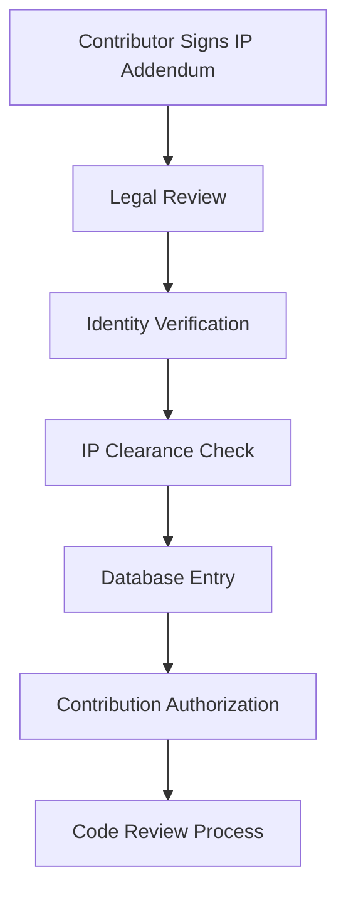

# Intellectual Property Management

This document outlines the intellectual property (IP) management framework for the WebQX Healthcare Platform, ensuring clear ownership, licensing, and contribution guidelines for all project participants.

## 📋 Table of Contents

- [Overview](#overview)
- [Licensing Framework](#licensing-framework)
- [Contributor Requirements](#contributor-requirements)
- [IP Assignment Process](#ip-assignment-process)
- [Patent Management](#patent-management)
- [Third-Party IP](#third-party-ip)
- [Healthcare-Specific Considerations](#healthcare-specific-considerations)
- [Compliance and Enforcement](#compliance-and-enforcement)

## 🎯 Overview

### Purpose
The WebQX IP Management framework ensures:
- **Clear ownership** of contributed code and documentation
- **Legal protection** for contributors and the project
- **Regulatory compliance** for healthcare software development
- **Open source sustainability** while supporting commercial applications
- **Patient safety** through proper IP governance

### Scope
This framework applies to all:
- Source code contributions
- Documentation and technical specifications
- Healthcare workflow definitions
- Clinical decision support algorithms
- Integration specifications and APIs
- Research publications and whitepapers

## ⚖️ Licensing Framework

### Primary License
**Apache License 2.0** serves as the foundation license for all WebQX contributions, providing:
- Permissive open source licensing
- Patent protection for contributors and users
- Commercial use compatibility
- Healthcare industry acceptance

### Dual Licensing Model
WebQX operates under a dual licensing approach:

#### Open Source Track
- **License:** Apache 2.0
- **Use Cases:** Academic research, non-commercial healthcare projects, community contributions
- **Restrictions:** Must comply with Apache 2.0 terms
- **Cost:** Free

#### Commercial Track
- **License:** Custom commercial licenses available
- **Use Cases:** Proprietary healthcare products, enterprise deployments, regulated environments
- **Benefits:** Additional support, indemnification, custom terms
- **Cost:** Negotiated licensing fees

### Healthcare Addendum
All contributors must also comply with healthcare-specific licensing terms addressing:
- Patient data protection requirements
- Clinical safety obligations
- Regulatory compliance responsibilities
- Medical device considerations

## 👥 Contributor Requirements

### Mandatory Documentation
All contributors must complete:

1. **[IP Assignment Addendum](../legal/ip-addendum.md)**
   - Copyright assignment to WebQX Health
   - Patent grant and defensive pledge
   - Healthcare-specific warranties

2. **Contributor License Agreement (CLA)**
   - Individual or corporate CLA
   - Electronic signature required
   - Maintained in contributor database

3. **Healthcare Compliance Acknowledgment**
   - Understanding of HIPAA/GDPR requirements
   - Commitment to patient safety principles
   - Agreement to clinical review processes

### Verification Process
1. **Legal Review:** All contributor agreements reviewed by legal team
2. **Identity Verification:** Confirm contributor identity and authority
3. **IP Clearance:** Verify no conflicting IP obligations
4. **Database Entry:** Record contributor status and agreements

## 📝 IP Assignment Process

### Copyright Assignment
Contributors assign the following rights to WebQX Health:

#### Assigned Rights
- **Exclusive copyright ownership** in original contributions
- **Right to sublicense** under any terms (including proprietary)
- **Right to enforce** copyright against infringers
- **Right to modify** and create derivative works

#### Retained Rights
Contributors retain:
- **Attribution rights** in project documentation
- **Right to use** own contributions under Apache 2.0
- **Academic publication** rights (subject to confidentiality)
- **Portfolio reference** rights for professional use

### Process Workflow

### Healthcare Contributions
Special considerations for healthcare-related contributions:

#### Clinical Knowledge
- **Medical expertise** contributions require qualification disclosure
- **Clinical workflows** must be based on published standards
- **Medical algorithms** require clinical validation
- **Safety-critical code** subject to enhanced review

#### Regulatory Implications
- **FDA considerations** for medical device features
- **CE marking** requirements for European deployment
- **Quality management** system compliance
- **Clinical evaluation** documentation

## 🔬 Patent Management

### Patent Grant
Contributors provide comprehensive patent grants:

#### Scope of Grant
- **Perpetual, worldwide** license to all patent claims
- **Non-exclusive** rights for open source use
- **Defensive patent pledge** against project users
- **Clinical safety exception** for patient protection

#### Patent Disclosure
Contributors must disclose:
- **Existing patents** covering contributions
- **Pending applications** related to contributions
- **Third-party patents** potentially affecting the project
- **Licensing obligations** from employers or other entities

### Defensive Patent Strategy
WebQX maintains a defensive patent approach:

#### Principles
- **Protect innovation** without hindering interoperability
- **Defensive use only** - no offensive patent litigation
- **Open source commitment** - patents available for OSS projects
- **Healthcare focus** - promote medical technology advancement

#### Patent Pool Participation
- **Open healthcare patent** pools where beneficial
- **Cross-licensing** agreements with compatible projects
- **Prior art documentation** to prevent frivolous patents
- **Industry collaboration** on healthcare standards

## 🔗 Third-Party IP

### Dependency Management
Careful management of third-party intellectual property:

#### License Compatibility
- **Apache 2.0 compatible** licenses preferred
- **Permissive licenses** (MIT, BSD) generally acceptable
- **Copyleft licenses** (GPL, LGPL) require special handling
- **Proprietary licenses** must be explicitly approved

#### Due Diligence Process
1. **License Review:** Verify compatibility with Apache 2.0
2. **Patent Analysis:** Check for patent obligations
3. **Attribution Requirements:** Document proper attribution
4. **Update Tracking:** Monitor license changes in dependencies

### Healthcare-Specific Dependencies
Special attention to healthcare libraries:

#### Medical Standards Libraries
- **HL7 FHIR** implementations and licensing
- **DICOM** toolkit licensing considerations
- **Medical coding** systems (ICD, SNOMED) licensing
- **Clinical decision** support rule licensing

#### Regulatory Compliance
- **FDA-cleared** software component licensing
- **CE-marked** medical device software licensing
- **Quality system** documentation requirements
- **Clinical validation** evidence requirements

## 🏥 Healthcare-Specific Considerations

### Clinical Safety Requirements
IP management must support clinical safety:

#### Safety-Critical Code
- **Enhanced IP review** for patient safety features
- **Clinical validation** requirements
- **Liability considerations** for medical functionality
- **Regulatory compliance** documentation

#### Medical Device Implications
- **Software as Medical Device** (SaMD) considerations
- **Quality management system** IP requirements
- **Clinical evaluation** documentation needs
- **Post-market surveillance** IP obligations

### Data Protection and Privacy
IP framework addresses healthcare data:

#### Patient Data Protection
- **HIPAA compliance** in IP agreements
- **GDPR requirements** for international contributors
- **Data processing** agreements for cloud services
- **Breach notification** procedures

#### Research and Development
- **Clinical research** data licensing
- **Publication rights** for research findings
- **Collaborative research** IP sharing
- **Academic partnership** agreements

## 🛡️ Compliance and Enforcement

### IP Monitoring
Proactive IP protection measures:

#### Monitoring Activities
- **Code scanning** for unauthorized use
- **Patent watching** for relevant filings
- **License compliance** auditing
- **Attribution verification** processes

#### Enforcement Procedures
1. **Informal Resolution:** Direct communication with violators
2. **Formal Notice:** Legal notice of infringement
3. **Legal Action:** Litigation as last resort
4. **Community Support:** Leverage open source community

### Violation Response
Clear procedures for IP violations:

#### Internal Violations
- **Contributor education** on proper procedures
- **Process improvement** to prevent recurrence
- **Legal consultation** for significant violations
- **Corrective measures** implementation

#### External Violations
- **Assessment** of violation severity and impact
- **Legal strategy** development
- **Community notification** when appropriate
- **Resolution tracking** and documentation

## 📞 Support and Resources

### Legal Support
- **IP Questions:** ip@webqx.health
- **Legal Compliance:** legal@webqx.health
- **Healthcare Regulations:** compliance@webqx.health

### Documentation
- **[IP Assignment Addendum](../legal/ip-addendum.md)** - Detailed contributor agreement
- **[NDA Template](../legal/nda-template.md)** - For sensitive collaborations
- **[Apache 2.0 License](../LICENSE.md)** - Project foundation license

### External Resources
- **[Apache Software Foundation](https://www.apache.org/licenses/)** - License guidance
- **[Healthcare IT Standards](https://www.healthit.gov/)** - Regulatory information
- **[FDA Software Guidance](https://www.fda.gov/medical-devices/digital-health-center-excellence)** - Medical device regulations

## 📊 Metrics and Reporting

### IP Health Metrics
Regular tracking of IP management effectiveness:

#### Key Metrics
- **Contributor compliance** rate with IP requirements
- **Patent disclosure** completeness
- **License violation** incidents and resolution time
- **Third-party dependency** license audit results

#### Reporting Schedule
- **Monthly:** IP compliance dashboard
- **Quarterly:** Comprehensive IP health review
- **Annually:** Strategic IP portfolio assessment
- **Ad-hoc:** Incident response and investigation reports

---

**Document Version:** 1.0  
**Last Updated:** January 2024  
**Next Review:** July 2024  
**Maintained By:** WebQX Legal and Engineering Teams

For questions about intellectual property management, contact: ip@webqx.health