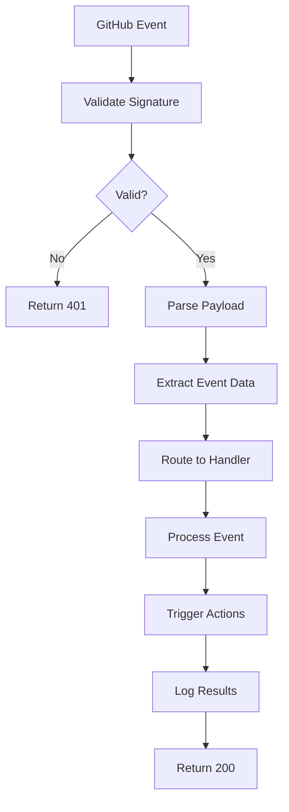

# GitHub Webhook Events Reference

This document describes the GitHub webhook events supported by the WebQX webhook handler and their processing logic.

## Overview

The webhook handler processes various GitHub events and triggers appropriate actions based on the event type and content. Each event type has specific processing logic tailored to healthcare platform needs.

## Supported Events

### 1. Push Events (`push`)

Triggered when code is pushed to the repository.

#### Event Data
```json
{
  "ref": "refs/heads/main",
  "before": "a10867b14bb761a232cd80139fbd4c0d33264240",
  "after": "0d1a26e67d8f5eaf1f6ba5c57fc3c7d91ac0fd1c",
  "commits": [
    {
      "id": "0d1a26e67d8f5eaf1f6ba5c57fc3c7d91ac0fd1c",
      "message": "Update patient portal UI",
      "author": {"name": "Developer", "email": "dev@webqx.health"},
      "added": ["patient-portal/components/NewComponent.tsx"],
      "modified": ["patient-portal/pages/dashboard.tsx"],
      "removed": []
    }
  ],
  "pusher": {"name": "developer", "email": "dev@webqx.health"},
  "repository": {...},
  "sender": {...}
}
```

#### Processing Logic
- **Main/Master Branch**: Triggers production deployment
- **Documentation Changes**: Updates documentation pipeline
- **Configuration Changes**: Triggers security scans
- **Healthcare Module Changes**: Validates HIPAA compliance

#### Triggered Actions
- `trigger-production-deployment` - For main branch pushes
- `update-documentation` - For .md file changes
- `security-scan` - For package.json, .yml, .yaml changes
- `hipaa-compliance-check` - For healthcare module changes

### 2. Pull Request Events (`pull_request`)

Triggered for pull request lifecycle events.

#### Event Actions
- `opened` - New PR created
- `closed` - PR closed (check `merged` flag)
- `synchronize` - PR updated with new commits
- `edited` - PR title/description edited
- `review_requested` - Review requested
- `ready_for_review` - Draft PR marked ready

#### Event Data
```json
{
  "action": "opened",
  "number": 123,
  "pull_request": {
    "id": 1234567890,
    "number": 123,
    "title": "Add telehealth module integration",
    "body": "This PR adds...",
    "state": "open",
    "draft": false,
    "merged": false,
    "head": {"ref": "feature/telehealth", "sha": "abc123..."},
    "base": {"ref": "main", "sha": "def456..."},
    "user": {"login": "developer"},
    "labels": [{"name": "healthcare"}, {"name": "feature"}]
  },
  "repository": {...},
  "sender": {...}
}
```

#### Processing Logic
- **Opened**: Run CI checks, assign reviewers, validate compliance
- **Synchronized**: Re-run CI checks and security scans
- **Merged**: Cleanup feature branch, trigger deployment
- **Healthcare Labels**: Additional HIPAA compliance checks

#### Triggered Actions
- `run-ci-checks` - Automated testing and validation
- `assign-reviewers` - Auto-assign based on changed files
- `cleanup-feature-branch` - Remove merged branches
- `hipaa-compliance-review` - For healthcare-related changes

### 3. Issues Events (`issues`)

Triggered for issue lifecycle events.

#### Event Actions
- `opened` - New issue created
- `closed` - Issue closed
- `reopened` - Issue reopened
- `edited` - Issue title/description edited
- `assigned` - Issue assigned to user
- `labeled` - Label added to issue

#### Event Data
```json
{
  "action": "opened",
  "issue": {
    "number": 456,
    "title": "Patient data sync error",
    "body": "When syncing patient data...",
    "state": "open",
    "labels": [{"name": "bug"}, {"name": "critical"}],
    "assignees": [{"login": "maintainer"}],
    "user": {"login": "reporter"}
  },
  "repository": {...},
  "sender": {...}
}
```

#### Processing Logic
- **Critical/Security Labels**: Immediate escalation
- **Bug Reports**: Auto-assign to appropriate team
- **Feature Requests**: Add to product backlog
- **Documentation**: Route to documentation team

#### Triggered Actions
- `triage-issue` - Automatic categorization and routing
- `notify-maintainers` - Alert relevant team members
- `escalate-critical-issue` - For critical/security issues
- `update-project-board` - Sync with project management

### 4. Release Events (`release`)

Triggered for release lifecycle events.

#### Event Actions
- `published` - Release published
- `created` - Release created but not published
- `edited` - Release details edited
- `deleted` - Release deleted

#### Event Data
```json
{
  "action": "published",
  "release": {
    "tag_name": "v2.1.0",
    "name": "WebQX Platform v2.1.0",
    "body": "## New Features\n- Telehealth integration\n...",
    "draft": false,
    "prerelease": false,
    "published_at": "2024-01-15T10:30:00Z"
  },
  "repository": {...},
  "sender": {...}
}
```

#### Processing Logic
- **Production Releases**: Deploy to production, notify users
- **Pre-releases**: Deploy to staging environment
- **Healthcare Compliance**: Validate compliance documentation

#### Triggered Actions
- `deploy-to-production` - For stable releases
- `deploy-to-staging` - For pre-releases
- `update-changelog` - Generate release notes
- `notify-users` - Send release notifications
- `compliance-documentation-update` - Update compliance docs

### 5. Workflow Run Events (`workflow_run`)

Triggered when GitHub Actions workflows complete.

#### Event Actions
- `completed` - Workflow finished (check `conclusion`)
- `requested` - Workflow triggered
- `in_progress` - Workflow running

#### Event Data
```json
{
  "action": "completed",
  "workflow_run": {
    "name": "CI/CD Pipeline",
    "status": "completed",
    "conclusion": "success", // success, failure, cancelled, skipped
    "run_number": 123,
    "event": "push",
    "head_branch": "main",
    "head_sha": "abc123..."
  },
  "repository": {...},
  "sender": {...}
}
```

#### Processing Logic
- **Success**: Update status checks, trigger deployments
- **Failure**: Create incident, notify team
- **Security Scans**: Process security reports
- **Compliance Checks**: Update compliance status

#### Triggered Actions
- `update-status-check` - Update commit status
- `notify-failure` - Alert on pipeline failures
- `create-incident` - For critical failures
- `process-security-report` - Handle security scan results
- `update-compliance-status` - Track compliance checks

### 6. Deployment Events (`deployment`)

Triggered for deployment events.

#### Event Data
```json
{
  "deployment": {
    "id": 123456,
    "environment": "production",
    "ref": "main",
    "task": "deploy",
    "description": "Deploy v2.1.0 to production"
  },
  "repository": {...},
  "sender": {...}
}
```

#### Processing Logic
- **Production Deployments**: Enhanced monitoring, rollback preparation
- **Staging Deployments**: Integration testing triggers
- **Healthcare Environments**: Additional compliance logging

#### Triggered Actions
- `update-deployment-status` - Track deployment progress
- `setup-monitoring` - Enhanced production monitoring
- `prepare-rollback` - Backup for quick recovery
- `compliance-audit-log` - Healthcare compliance logging

### 7. Ping Events (`ping`)

Webhook test event sent when webhook is first created.

#### Event Data
```json
{
  "zen": "Mind your words, they are important.",
  "hook_id": 123456,
  "hook": {
    "type": "Repository",
    "id": 123456,
    "active": true,
    "events": ["push", "pull_request"]
  },
  "repository": {...}
}
```

#### Processing Logic
Simple acknowledgment to confirm webhook is working.

#### Triggered Actions
- `confirm-webhook-setup` - Log successful webhook configuration

## Event Processing Flow



## Custom Event Handling

You can customize event processing by modifying the handlers in `lambda/lib/eventProcessor.js`:

```javascript
// Example: Custom handling for healthcare-specific events
async function handlePushEvent(payload, context) {
    const { commits, repository } = payload;
    
    // Check for HIPAA-related changes
    const hasHipaaChanges = commits.some(commit =>
        commit.modified?.some(file => 
            file.includes('patient-portal/') || 
            file.includes('ehr-integrations/')
        )
    );
    
    if (hasHipaaChanges) {
        return {
            action: 'hipaa-compliance-check',
            triggeredActions: ['security-scan', 'compliance-audit']
        };
    }
    
    // Default processing...
}
```

## Event Filtering

Configure which events to receive in GitHub webhook settings:

### Recommended for Healthcare Platforms
- ✅ **Push** - Code changes
- ✅ **Pull requests** - Code review process
- ✅ **Issues** - Bug tracking and feature requests
- ✅ **Releases** - Version management
- ✅ **Workflow runs** - CI/CD pipeline status
- ✅ **Deployments** - Deployment tracking

### Optional Events
- **Fork** - Repository forks
- **Watch** - Repository stars/watches
- **Wiki** - Wiki page changes
- **Package** - Package publication
- **Security advisory** - Security vulnerabilities

## Error Handling

The webhook handler includes comprehensive error handling:

1. **Signature Verification Errors** → 401 Unauthorized
2. **Payload Parsing Errors** → 400 Bad Request
3. **Processing Errors** → 500 Internal Server Error (with retry)
4. **Timeout Errors** → Automatic Lambda retry

All errors are logged to CloudWatch with detailed context for debugging.

## Rate Limiting

GitHub webhook delivery includes rate limiting protection:
- Maximum 1000 webhook deliveries per hour per repository
- Failed deliveries are retried with exponential backoff
- Lambda concurrent execution limits prevent overload

## Testing Events

Test webhook events locally or in development:

```bash
# Test push event
curl -X POST http://localhost:3000/webhook \
  -H "Content-Type: application/json" \
  -H "X-GitHub-Event: push" \
  -H "X-GitHub-Delivery: 12345-67890" \
  -d @tests/fixtures/push-event.json

# Test pull request event
curl -X POST http://localhost:3000/webhook \
  -H "Content-Type: application/json" \
  -H "X-GitHub-Event: pull_request" \
  -H "X-GitHub-Delivery: 12345-67891" \
  -d @tests/fixtures/pull-request-event.json
```

## Monitoring Events

Monitor webhook processing through CloudWatch:

```bash
# View webhook invocations
aws logs filter-log-events \
  --log-group-name /aws/lambda/webqx-github-webhooks-dev \
  --filter-pattern "Processing" \
  --start-time $(date -d '1 day ago' +%s)000

# Count events by type
aws logs filter-log-events \
  --log-group-name /aws/lambda/webqx-github-webhooks-dev \
  --filter-pattern "push-processed" \
  --start-time $(date -d '1 day ago' +%s)000 | grep -c "push-processed"
```